# Portfolio

## 작성자 소개

- 직업: Web Frontend Developer
- 경력: 2010 ~ 현재 (10년차)
- 현 근무지: StyleShare
- 주력 기술
  - ES6, TypeScript
  - React, Redux, Next
  - Angular, RxJs, ngRx
  - SASS, styled-components
  - gulp
- 보조 기술
  - vue, vuex
  - node.js
  - docker
  - AWS EB/S3
  - git (버전관리)
  - zeplin (디자이너 협업 도구)
- 과거 기술 경험
  - angular.js, knockout.js
  - java, spring, struts, mybatis
  - C#.NET, WebForm, WinForm
  - Delphi, VisualBasic, VBA
  - PHP, CodeIgniter
  - MS-SQL, Oracle10G, MySQL, SQLite
  - Flex
  - Linux CentOS

### 사내 업무용 라이브러리

현 직장에서 쓰이는 자체 제작 기능 중 라이브러리화 된 것들.

- [Context Kit](https://github.com/thesoncriel/context-kit)
  - React 내 Context 를 쉽게 쓸 수 있도록 만들어주는 라이브러리

### 사내 개발 가이드 문서

현 직장의 웹프론트엔드 개발 규칙을 만들기위해 제안된 문서이다.

- [아키텍처 개발 가이드](https://github.com/thesoncriel/coding-guide/tree/master/architecture)
- [UI 설계 가이드](https://github.com/thesoncriel/coding-guide/tree/master/sw-design)
  
### 사내 개발 블로그내 작성했던 글 모음

현 직장의 다른 개발자분들과 개발 관련 이야기를 많이 해 보고자 작성 했던 글이다.

- [바로가기](https://github.com/thesoncriel/todays-tip)

## [똑닥웹앱 - Click to sample source](https://github.com/thesoncriel/dd-webapp)

비브로스의 똑닥을 홍보하고 건강정보를 제공하기 위한 사이트 이다.

반응형으로 제작되어 모바일, 태블릿에 각각 최적화된 화면을 보여줄 수 있으며
메인 컨텐츠의 경우, 스크롤에 따른 애니메이션을 보여주도록 제작 하였으며,
대기현황판에서 쓰인 SlotNumber 컴포넌트를 재활용하여 동적인 컨텐츠 제작에 사용 되었다.

그리고 각 컴포넌트의 역할 분리 및 재사용성을 위해 [Atomic Design](https://brunch.co.kr/@ultra0034/63) 구조로 작성 하였다.

[똑닥 홈페이지 바로가기](https://www.ddocdoc.com)

### 사용기술

- Next (SSR이 필요하여 사용)
- Redux
  - redux-thunk
- styled-components
- react-slick (슬라이드 컨텐츠용)
- react-waypoint
  - 사용자 스크롤에 따라 viewport 안에 컴포넌트가 보여짐 여부로 애니메이션 효과를 주기 위해 사용.
- react-lazyload
  - 여러개의 이미지 출력 시 실제 보여줄 때만 불러오는 lazyload 를 이용 하기위해 사용.
- react-markdown
  - 이용약관 같은 텍스트 위주 컨텐츠를 markdown 으로 관리하고 그것을 일반 웹페이지로 보여주기 위해 사용.
- lodash
  - throttle, debounce 사용을 위해 포함.
- TypeScript
- gulp (AWS EB 배포용)
  - spritesmith (css bg sprite 제작용)
  - docker

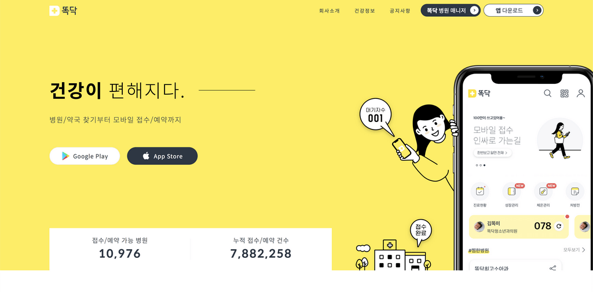

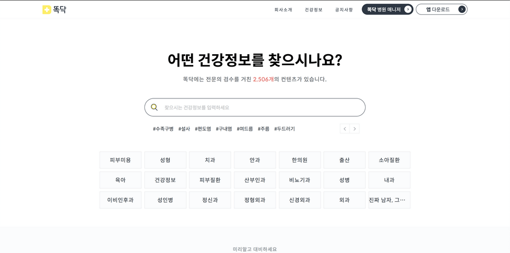
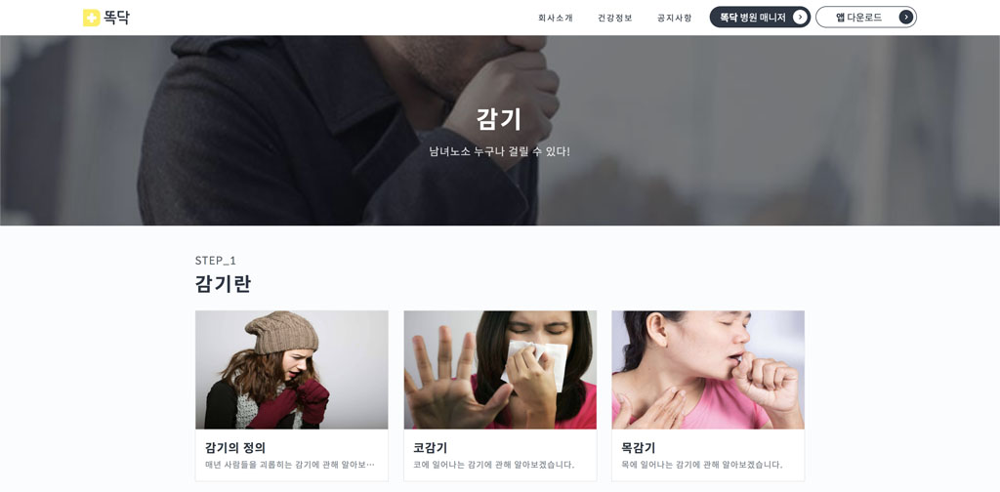
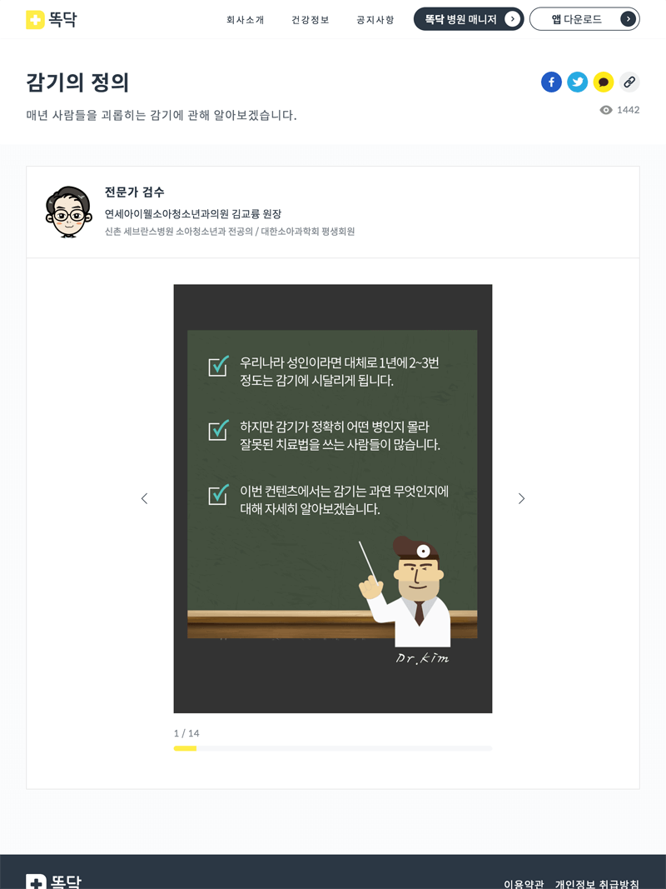

## 똑닥 대기현황판

비브로스 똑닥의 높은 트래픽에 기여한 프로젝트다.
단일 화면이지만 사용 패턴이 매우 다양했던 관계로 백엔드에서 줄 수 있는 데이터 시나리오를 수십가지로 구성하여 테스트 해볼 수 있는 테스트 페이지를 함께 만들었으며
서비스 안정화에 기여하였다.

3자리 숫자가 smooth 하게 돌아가는 SlotNumber 컴포넌트를 직접 만들어서 적용 하였다.

그리고 각 컴포넌트의 역할 분리 및 재사용성을 위해 [Atomic Design](https://brunch.co.kr/@ultra0034/63) 구조로 작성 하였다.

### 사용기술

- Next (SSR이 필요하여 사용)
- MobX
- styled-components
- TypeScript
- gulp (AWS EB 배포용)
  - spritesmith (css bg sprite 제작용)
  - docker

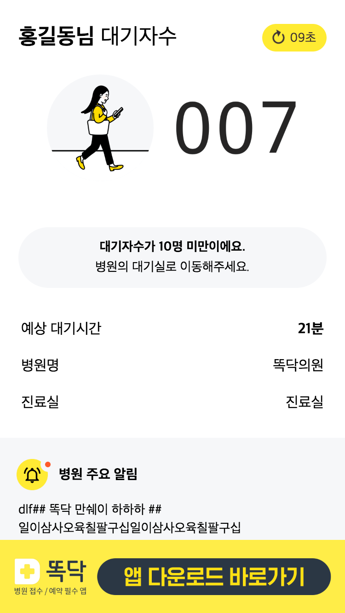
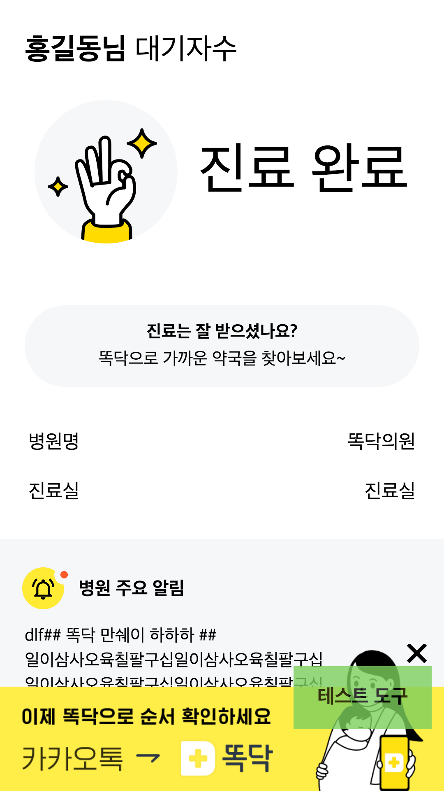

## 영유아검진 문진표

병원 예약/접수앱 똑닥만이 가진 간판 서비스, 영유아검진!
만 6세 미만 유아들을 대상으로 실시하는 건강검진 및 발달선별 검사지를
똑닥으로 원하는 소아과를 예약하고 앱 내에서 간편하게 작성하여 이를 병원에서 실제로 진료 업무에 이용할 수 있게 해 준다.

이 서비스 하나로 아이 보호자는 소아과 내 오프라인 작성, 혹은 공인인증서가 필요한 온라인 서비스가 필요치 않게 되었으며
병원은 작성된 문진표를 일일이 건강보험공단 웹UI에 일일이 기입하는 업무가 사실상 필요 없어졌다.
똑닥이란 서비스를 알리고 이용률을 높이는데 크게 기여 하였다.

건강보험공단에서 제공하는 문진표를 json 데이터화 하고 그 문진 패턴을 분석하여 스키마를 제작, 데이터 기반 동적 UI (Dynamic Data-Driven User Interface)를 설계하여 제작 하였다.
스키마의 각 UI 정보에는 Backend API에서 제시되는 항목명이 매칭되어 있고, 저장 시 사용자가 쌓아 놓은 데이터를 API 가 원하는 형태로 변환하여 전달 한다.
저장된 검진 내용이 있을 경우 역으로 백엔드 데이터를 프론트엔드 UI에 맞게 바꾸어서 다시 Binding 한다.

한편, 병원어드민에서 진료 시 사용될 미리보기 페이지와 건강보험공단에 데이터연계를 위해 업로드 할 dat 파일을 각각 어떻게 웹에 출력하고 파일에 기록할지 여부도
별도 json 스키마로 구성하고 이를 이용토록 하였다.

앱 내에서 보여주는 웹 문진표와 미리보기 및 파일 다운로드 서비스를 비 개발자들도 테스트할 수 있는 별도 페이지를 만들었으며
함께 QA를 진행하여 서비스 완성도를 더욱 높였다.

### 사용기술

- vue
- vuex
- sass
- gulp (AWS S3 배포용)
  - spritesmith (css bg sprite 제작용)

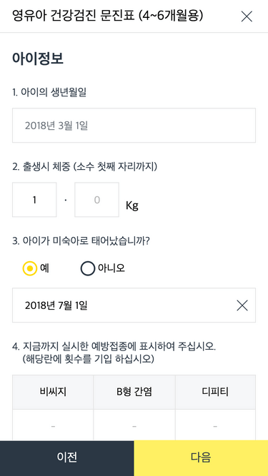

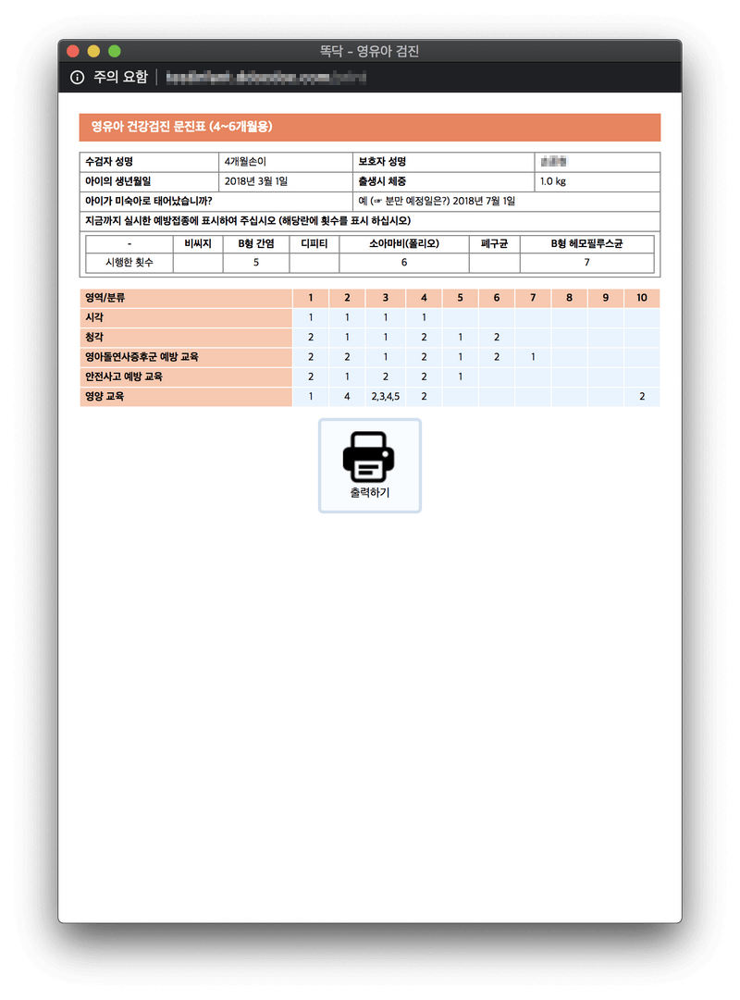

## 똑닥세일즈

비브로스와 협력관계인 EMR 업체에서 그 업체가 EMR 서비스하는 병원이 똑닥을 얼마나 잘 쓰는지를 확인하기 위한 도구 이다.

각 EMR 및 대리점별로 예약, 접수, 대기현황판의 사용률 확인과 더불어
영업자들이 키오스크 계약서를 작성하고 관리할 수 있도록 별도 도구를 제공한다.

그리고 각 컴포넌트의 역할 분리 및 재사용성을 위해 [Atomic Design](https://brunch.co.kr/@ultra0034/63) 구조로 작성 하였다.

### 사용기술

- React
- Redux
  - redux-thunk
- styled-components
- material-ui
- lodash
  - throttle, debounce 사용을 위해 포함.
- TypeScript
- gulp (AWS S3 배포용)

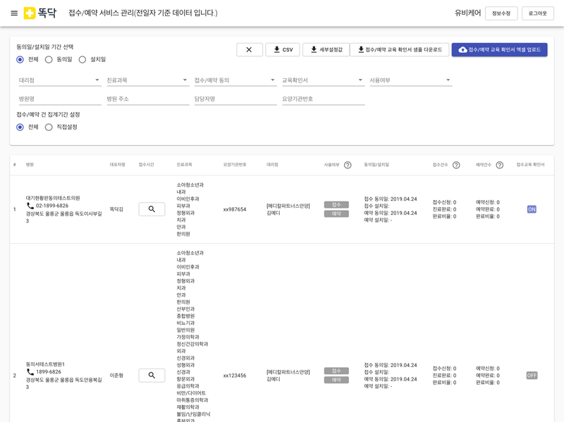
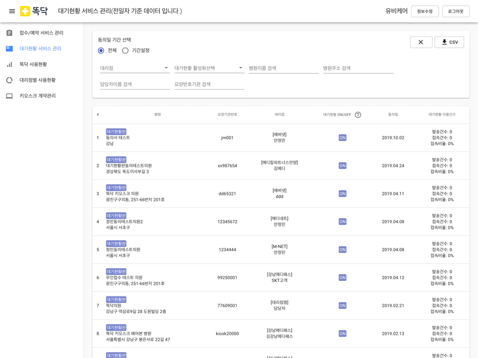
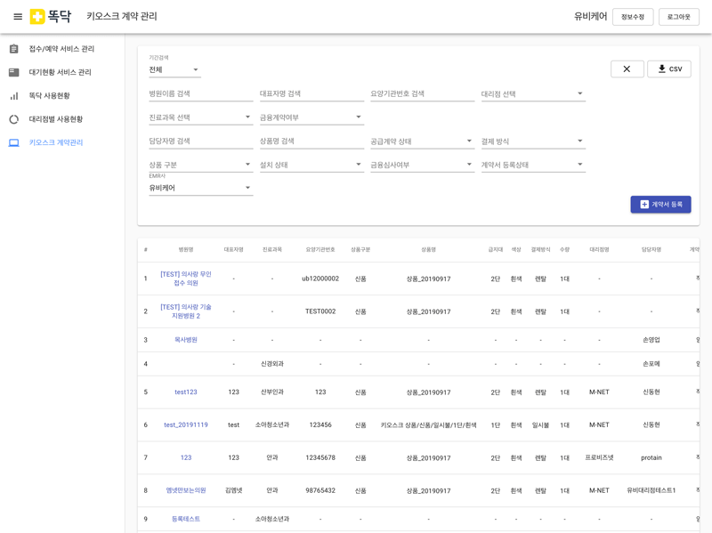
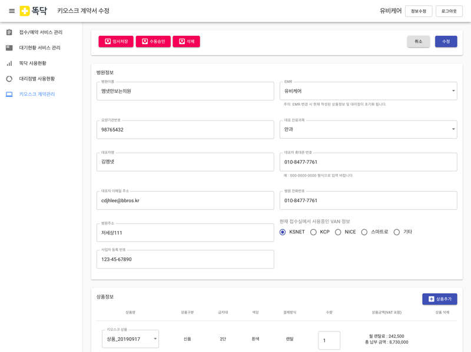
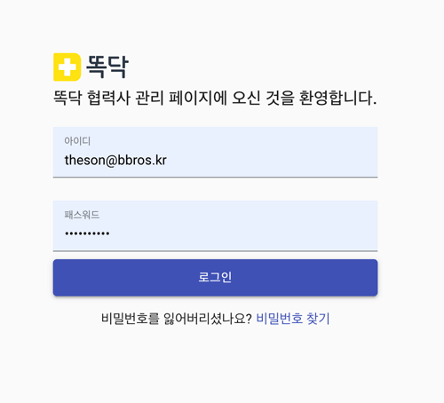

## 똑닥 병원어드민

똑닥을 서비스하는 병원에서 똑닥의 각종 설정들을 제어할 수 있는 도구를 제공하는 사이트 이다.

병원의 진료시간과 각종 진료실 설정, 접수/예약, 진료항목 및 무인접수 관련 설정을 다루며
사전문진과 대기현황판 설정, 그리고 영유아검진 관련 서비스를 이용할 수 있다.

한편, 병원어드민의 메인 소개 페이지에서 쓰일 Slider 가 필요 했는데,
작성 당시(2018~19년) jquery 없이 angular 만으로 동작되는 슬라이더 라이브러리가 없어서 자체 제작하여 사용 하였다.

본 서비스 이용 시 일반적으로 각 병원의 EMR 차트 프로그램 (예: 의사랑)으로 호출하여 이용하게 된다.

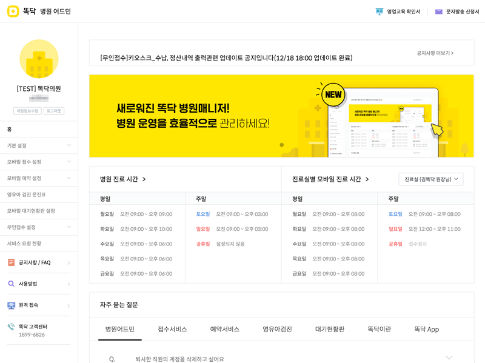
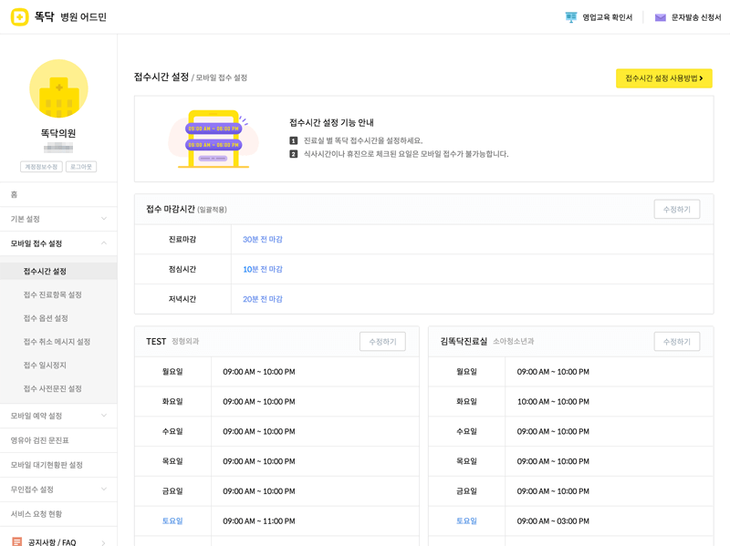
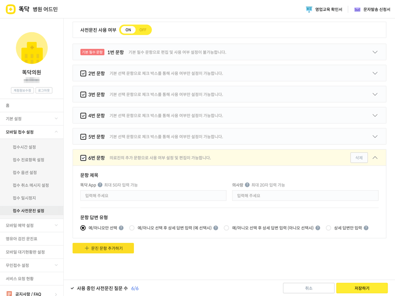
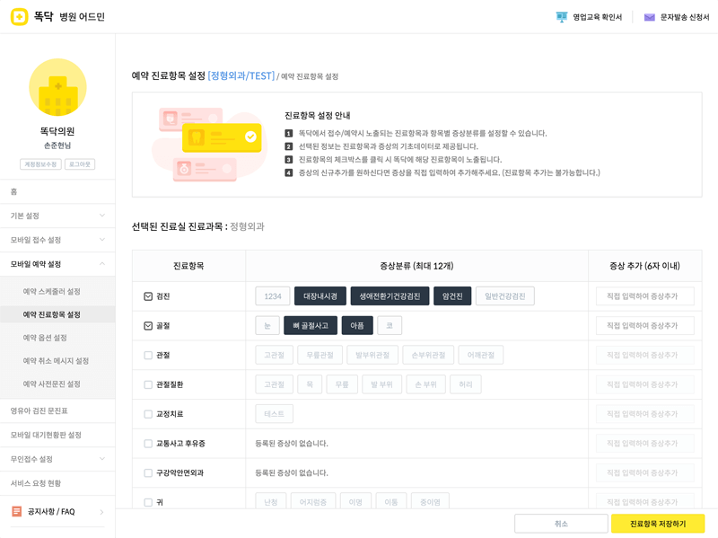
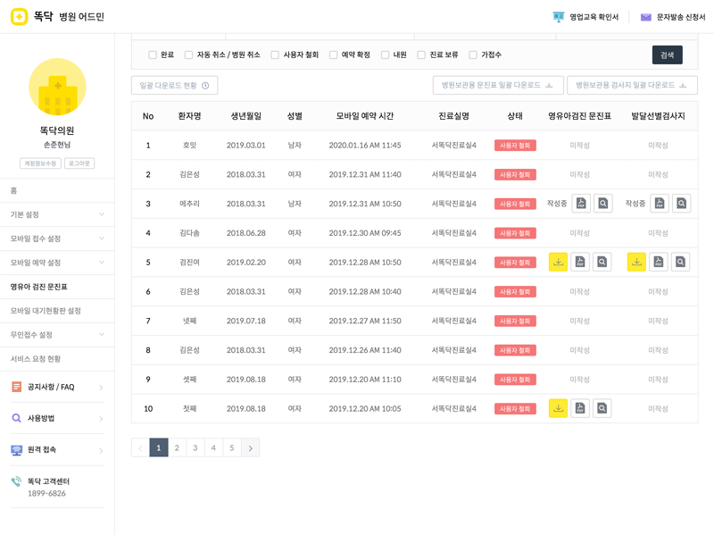
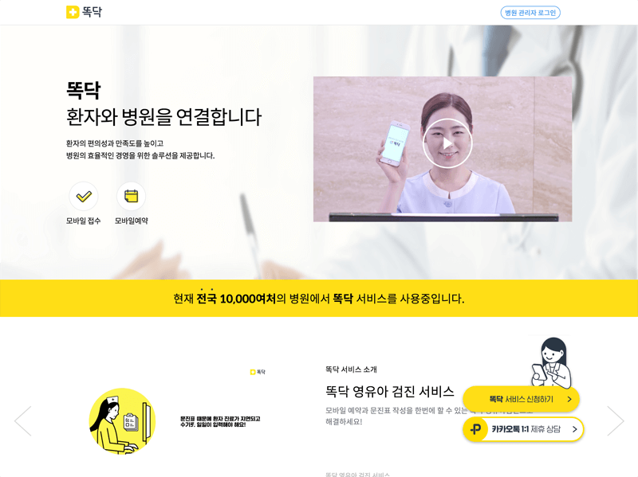

### 사용기술

- Angular 8
  - rxjs 6
- ngRx
- ngBootstrap
- SASS
- TypeScript
- gulp (AWS S3 배포용)
  - spritesmith (css bg sprite 제작용)

## 병원어드민: 예약스케줄러

병원 어드민에 포함된 기능으로서 예약시간을 각 진료실과 진료과목에 맞추어 입맛대로 커스터마이징 할 수 있다.

특정 연월을 선택하여 원하는 주간에서 미리 지정한 예약시간 범위내에서 드래그 하거나 클릭하여 스케줄을 채워나갈 수 있다.

덧붙여 아래와 같은 기능을 적용시켜 간호사/의사가 스케줄 작성 시 좀 더 편리하게 이용할 수 있다.

- 주간별 설정 및 월 전체 적용 (현재 편집하는 주간을 현재 월간에 모두 적용)
- 일/주/전월 복사 기능
- 일/주/월 초기화
- 진료항목 및 예약가능 인원 설정
- 처음 사용자를 위한 마법사 기능 적용

예약스케줄러 홈 화면

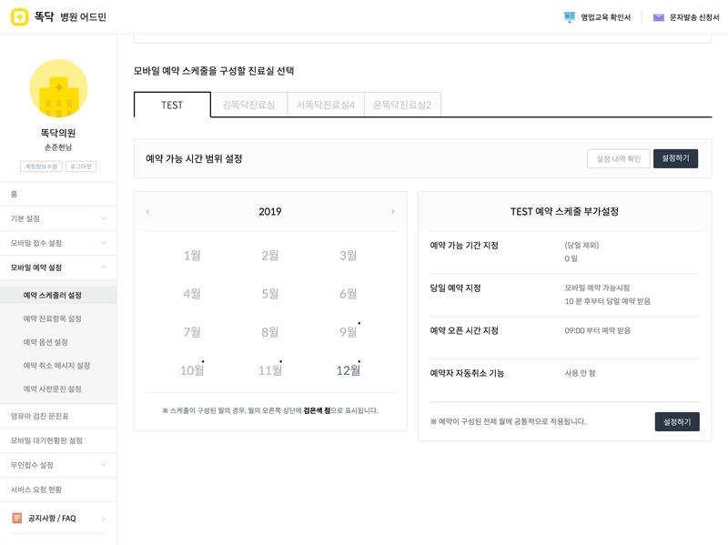

예약스케줄러 전체 모습

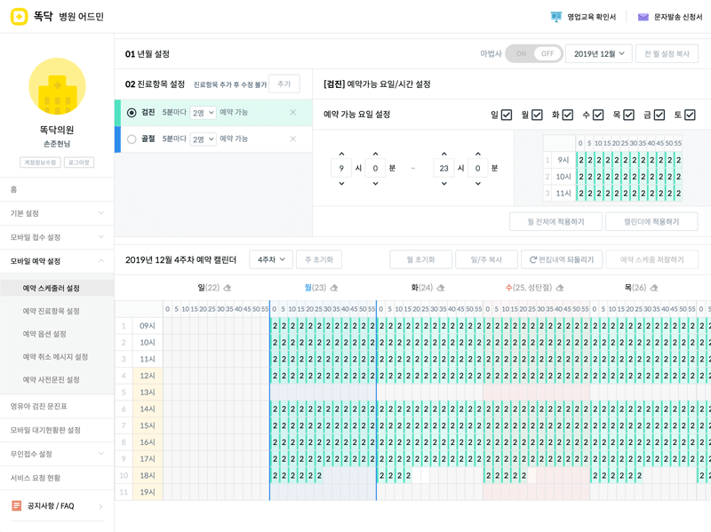

마법사 수행 화면

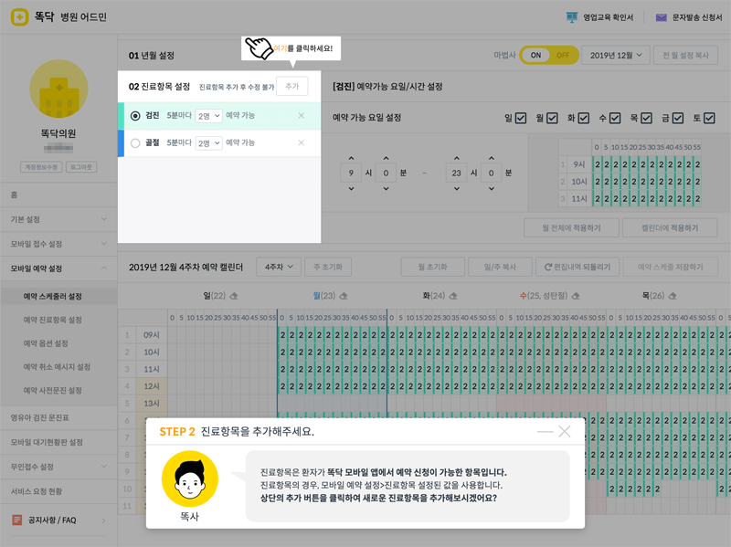

전월 복사

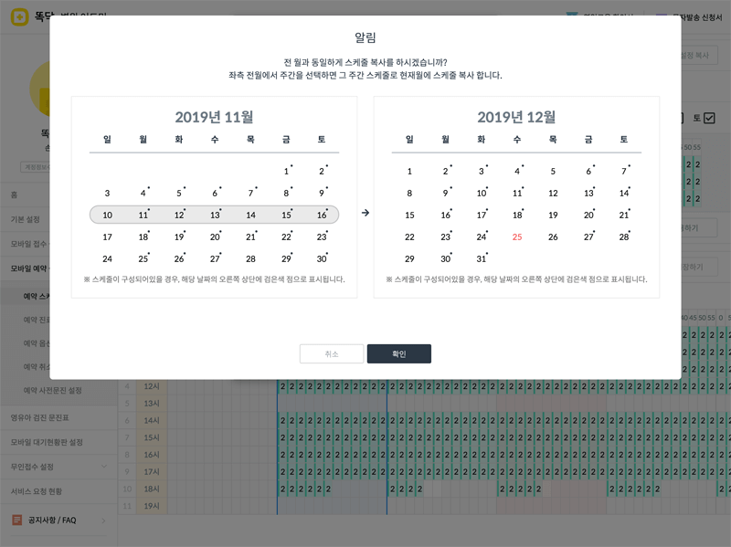

일/주 복사

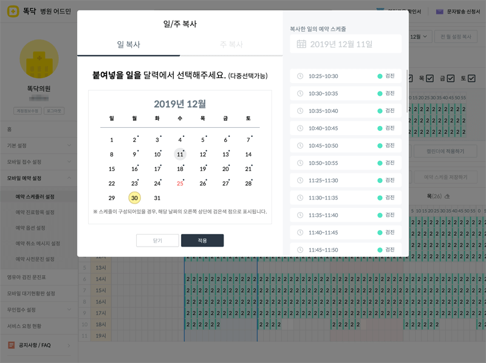

## 개인 코딩 가이드

개발시 지키고 있는 코딩 가이드.
이미 지키고 있던 다른 규칙이 정리 되거나 새로운 좋은 규칙을 발견하면 이 곳에 정리 해 둔다.
[코딩가이드](https://github.com/thesoncriel/coding-guide)

## 기타 과거 프로젝트 이력

- [이전 직장 프로젝트](legacy.md)
  - 2010 ~ 2017년 까지, 각 회사별로 참여했던 프로젝트를 정리 해 놓았다.
- [학생시절 프로젝트](student.md)
  - 2001 ~ 2010년 까지, 취미로 만든 토이 프로젝트나 교내 과제 프로젝트들을 볼 수 있다.
